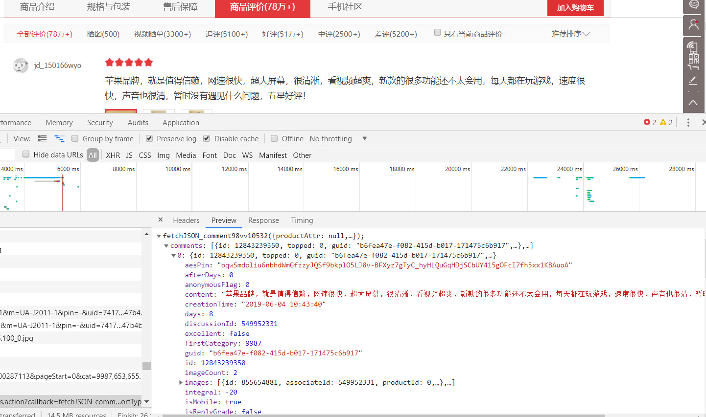
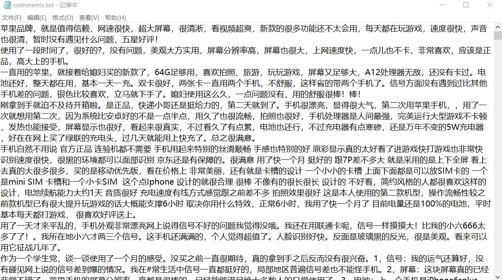
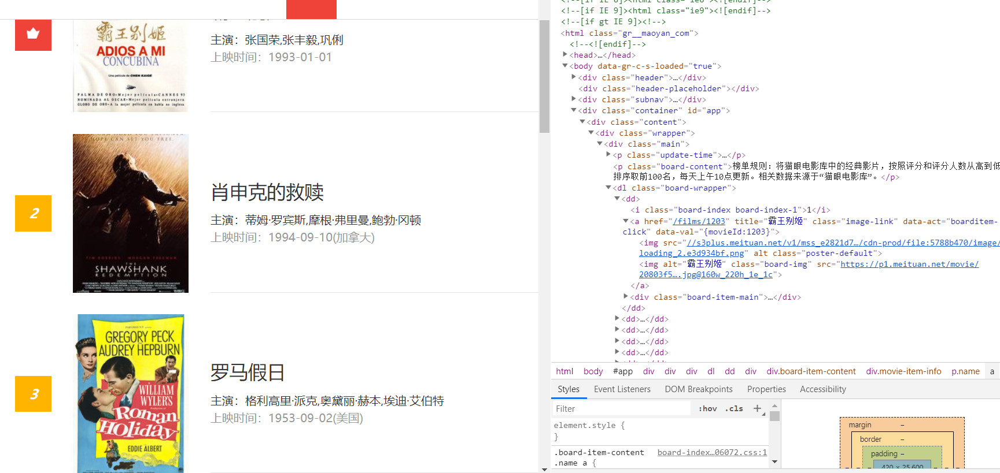
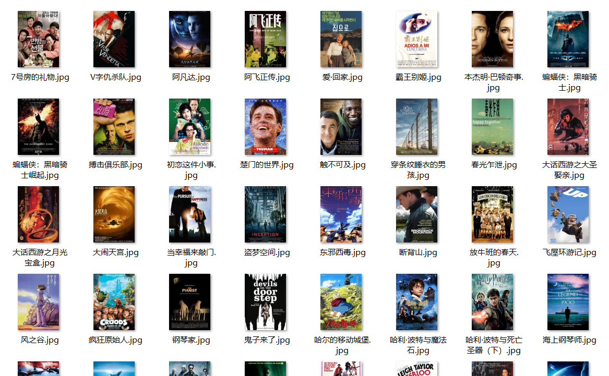
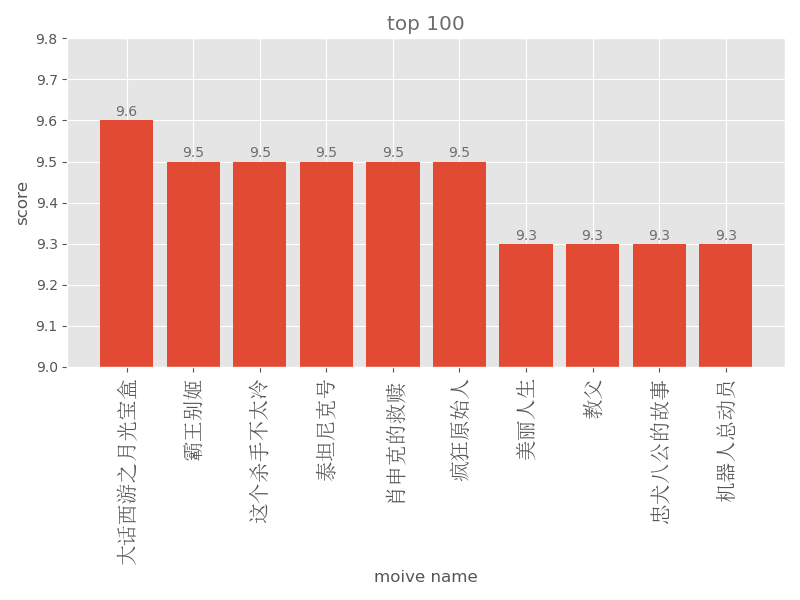
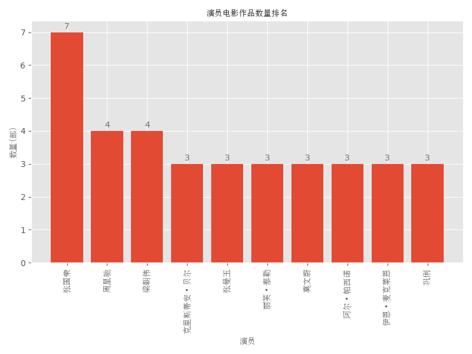
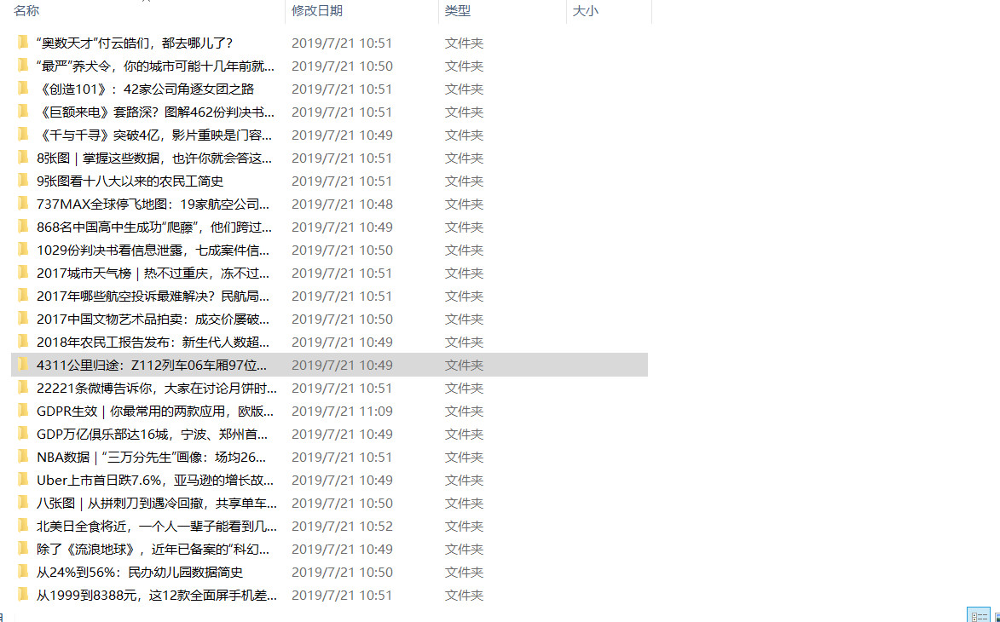
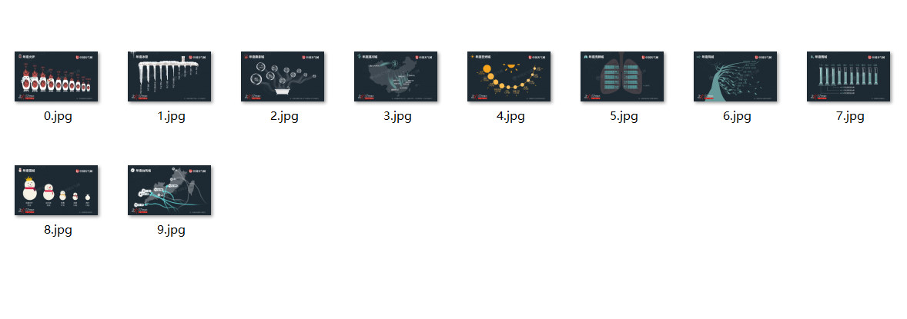
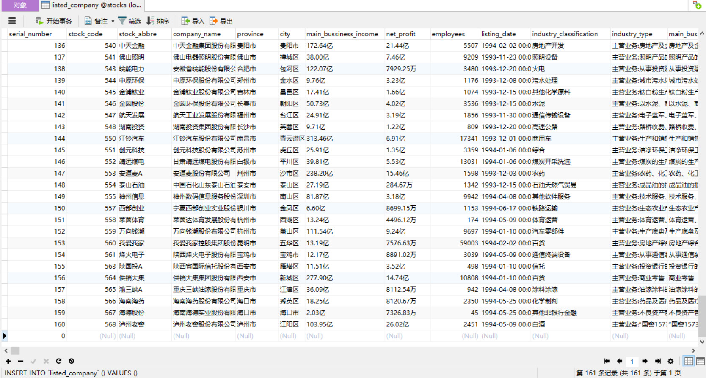

## Spider Practice

* apple

Climb the iphone XS Max comments from Jingdong, extrat comment part from the web page, write it to the local file, and using jieba word segmentation and using the wordcloud visualize the comments.

* maoyan

Catch the information of the top 100 movies from Cat Eye Movie Network, parse and write to local files, and download the corresponding movie cover. Then view the distribution of the number of movies by region, year and actor respectively.

**Covers:**

**Visualization:**

.png)

电影数量分布.png)

* pengpai

Crawl the website using ajax technology, take the Pengpai news as an example, crawl the pictures in the article on the website.

* stocks

Using Python to crawl a part of the listed company information from the website and write it to the local database.

* wallpapers

Crawl a desktop website with Python and download 119 sets of beautiful desktops.

